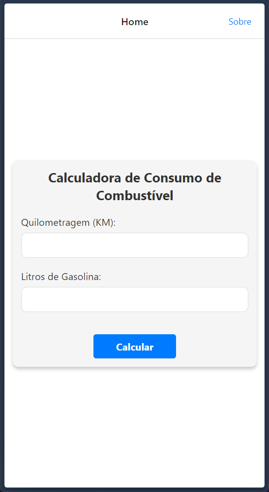
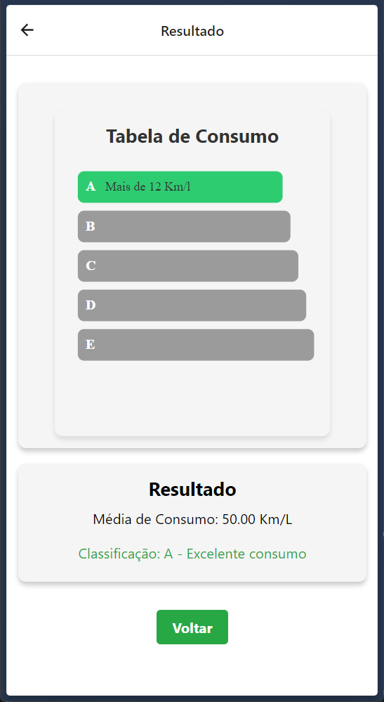

# Calculadora de Consumo de Combustível ⛽📊



## Descrição

Esta aplicação React Native permite calcular o consumo de combustível com base na quilometragem e na quantidade de litros de gasolina utilizada. A aplicação apresenta uma interface intuitiva que facilita o cálculo e a visualização do resultado, exibindo a classificação de consumo com base na média calculada. 🚗💨



---

## Funcionalidades

- **📏 Cálculo de Consumo:** Insira a quilometragem e a quantidade de litros para calcular a média de consumo de combustível.
- **📊 Classificação Dinâmica:** A aplicação classifica o consumo em diferentes faixas e destaca a faixa correspondente.
- **🎨 Interface Intuitiva:** Design amigável e fácil de usar, garantindo uma experiência de usuário eficiente.

---

## Instalação

Siga as etapas abaixo para configurar e executar a aplicação localmente.🛠️

### Pré-requisitos

- **Node.js** (versão 12 ou superior)
- **React Native CLI** ou **Expo CLI**
- **Android Studio** (para emulador Android) ou **Xcode** (para emulador iOS)
- Conexão à internet para acessar possíveis APIs e recursos. 🌐

### Passos

1. Clone este repositório:

   ```bash
   git clone https://github.com/eduardosichelero/Consumo-Inteligente.git
   
   cd consumoVeiculo
   ```

2. Instale as dependências:

   ```bash
   npm install
   ```

3. Execute a aplicação:

   - Utilizando o node:
     ```bash
     npm start
     ```
   - Para Android:
     ```bash
     npx react-native run-android
     ```
   - Para iOS:
     ```bash
     npx react-native run-ios
     ```

## Uso

Ao abrir a aplicação, você será recebido com uma tela para inserir a quilometragem e a quantidade de litros de gasolina. Após inserir os dados e clicar em "Calcular", a aplicação exibirá a média de consumo e a classificação correspondente, com base nas faixas predefinidas. A tela de resultado também apresenta uma tabela dinamica com as faixas de consumo destacadas.📈

## Tecnologias Utilizadas

- **React Native:** Framework para desenvolvimento de aplicações móveis nativas utilizando React.
- **Axios:** Para realizar as requisições HTTP e manipular dados.

## Contribuidores

- **Eduardo da Silva Sichelero** RA: 1134933
- **Rafael Klein** RA: 1134873

Este projeto foi desenvolvido como parte da disciplina de **Programação e Engenharia de Software**. 🎓👨‍💻
